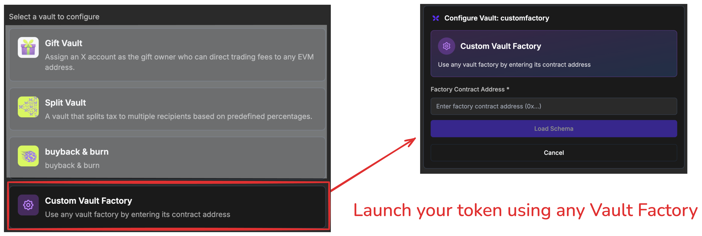
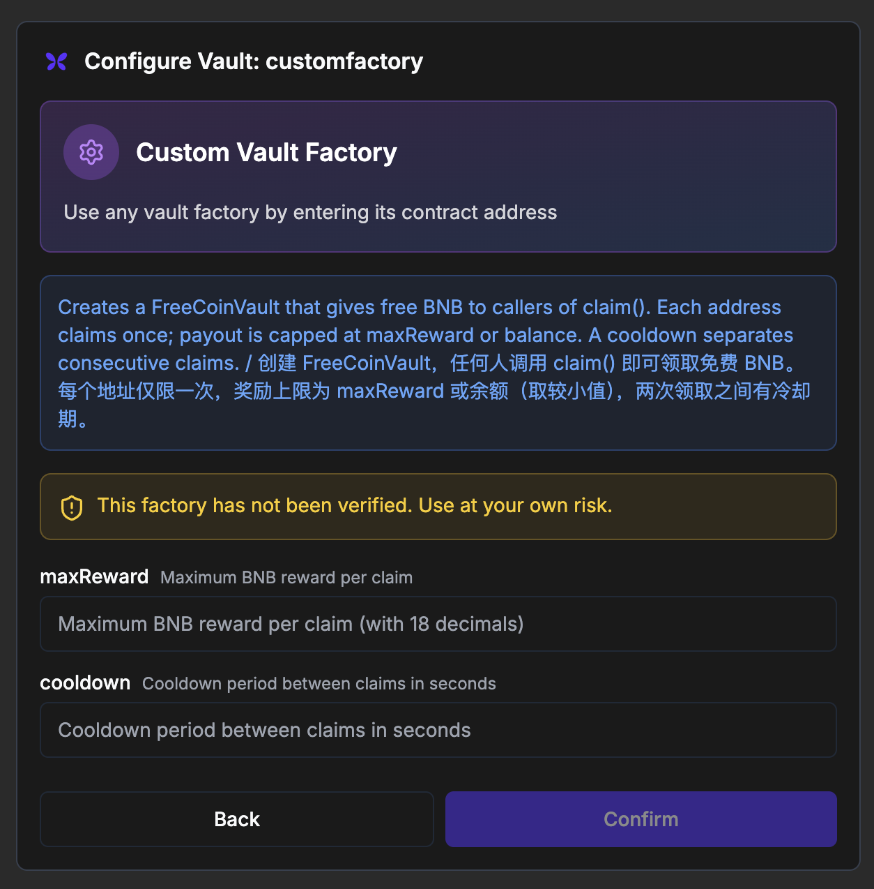
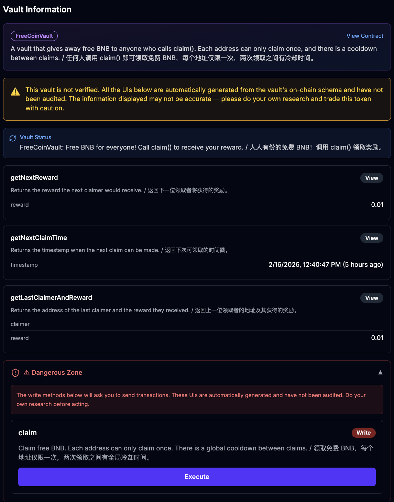

# Flap Tax Vault V2 Example

> Note that it is now permissonless to launch a token using a vault on Flap.sh. You don't need to reach us to regsiter your vault factory or get whitelisted. Just implement the vault factory and vault contracts using the V2 interfaces, deploy them, and then go to Flap.sh to create your token using your own vault factory.  

  

This repo will include example implementations of Flap Tax Vaults using the new V2 interfaces. We will udpate more examples in the future, but for now, we have implemented a simple "FreeCoin" vault that gives free BNB to users who call the `claim()` function, with a cooldown period and a maximum reward limit.  

---

## Table of Contents

- [Directory Structure](#directory-structure)
- [The Flap Tax Vault V2 Interfaces](#the-flap-tax-vault-v2-interfaces)
- [The FreeCoin Vault Example](#the-freecoin-vault-example)
- [How to Use the Vault Factory](#how-to-use-the-vault-factory)
  - [Step 1 — Implement your vault and factory](#step-1--implement-your-vault-and-factory)
  - [Step 2 — Describe the UI schema](#step-2--describe-the-ui-schema)
  - [Step 3 — Deploy your factory](#step-3--deploy-your-factory)
  - [Step 4 — Launch a token using your factory](#step-4--launch-a-token-using-your-factory)
- [Writing Integration Tests Before Audit](#writing-integration-tests-before-audit)
  - [Required test coverage before audit](#required-test-coverage-before-audit)
  - [Running the tests](#running-the-tests)
  - [Prank convention in tests](#prank-convention-in-tests)

---

## Directory Structure

The only mandated and immutable directory is `src/flap/`. It contains the canonical Flap vault interface files. Your own vault source files live directly under `src/`, alongside `src/flap/`.

```
src/
├── flap/              ← REQUIRED & IMMUTABLE — do not rename or modify
│   ├── IPortal.sol
│   ├── IVaultFactory.sol
│   ├── IVaultPortal.sol
│   ├── IVaultSchemasV1.sol
│   ├── VaultBase.sol
│   ├── VaultBaseV2.sol
│   └── VaultFactoryBaseV2.sol
└── YourVault.sol      ← your vault implementation(s) go here
```

> ⚠️ Future compliance checkers will assume `src/flap/` exists with exactly this structure. Do not rename or relocate this directory.


## The Flap Tax Vault V2 Interfaces 

Flap Tax Vault V2 are fully compatible with the V1 version. The main difference is that the V2 version uses the new VaultFactoryBaseV2 and VaultBaseV2 interfaces, which include additional functions for UI schema and metadata. With these UI schema functions, the vault can provide more information about its parameters and how to interact with it, which can be used for automatically generating user interfaces on Flap.sh.  

- [VaultFactoryBaseV2](src/flap/VaultFactoryBaseV2.sol): This is the base interface for vault factories. It includes functions for creating vaults, as well as new functions for providing metadata and UI schema for the vaults it creates.   
- [VaultBaseV2](src/flap/VaultBaseV2.sol): This is the base interface for vaults. It includes functions for interacting with the vault, as well as new functions for providing metadata and UI schema for the vault itself.   

All the above interfaces include very detailed NatSpec comments that describe the purpose and usage of each function, as well as the expected behavior of the vaults. We encourage you to read through the interfaces to understand how to implement your own vaults using the V2 version. 


## The FreeCoin Vault Example  

For example, for the [FreeCoin](src/FreeCoin.sol) vault, the factory has `vaultDataSchema()` function that describes the parameters of the vault:  


```solidity 
/// @inheritdoc VaultFactoryBaseV2
function vaultDataSchema() public pure override returns (VaultDataSchema memory schema) {
    schema.description = unicode"Creates a FreeCoinVault that gives free BNB to callers of claim(). "
        unicode"Each address claims once; payout is capped at maxReward or balance. "
        unicode"A cooldown separates consecutive claims. / " unicode"创建 FreeCoinVault，任何人调用 claim() 即可领取免费 BNB。"
        unicode"每个地址仅限一次，奖励上限为 maxReward 或余额（取较小值），两次领取之间有冷却期。";
    schema.fields = new FieldDescriptor[](2);
    schema.fields[0] = FieldDescriptor("maxReward", "uint256", "Maximum BNB reward per claim", 18);
    schema.fields[1] = FieldDescriptor("cooldown", "uint256", "Cooldown period between claims in seconds", 0);
    schema.isArray = false;
}
```

Based on the above spec, we will show the following UI for the vault on Flap.sh:  
 
  


And the FreeCoin Vault itself has a `vaultUISchema()` function that describes the parameters and functions of the vault:  

```solidity 

    /// @inheritdoc VaultBaseV2
    function vaultUISchema() public pure override returns (VaultUISchema memory schema) {
        schema.vaultType = "FreeCoinVault";
        schema.description = unicode"A vault that gives away free BNB to anyone who calls claim(). "
            unicode"Each address can only claim once, and there is a cooldown between claims. / "
            unicode"任何人调用 claim() 即可领取免费 BNB，每个地址仅限一次，两次领取之间有冷却时间。";

        schema.methods = new VaultMethodSchema[](4);

        // ── View: getNextReward() ────────────────────────────────────────
        schema.methods[0].name = "getNextReward";
        schema.methods[0].description = unicode"Returns the reward the next claimer would receive. / 返回下一位领取者将获得的奖励。";
        schema.methods[0].inputs = new FieldDescriptor[](0);
        schema.methods[0].outputs = new FieldDescriptor[](1);
        schema.methods[0].outputs[0] = FieldDescriptor("reward", "uint256", "Next reward amount in BNB", 18);
        schema.methods[0].approvals = new ApproveAction[](0);

        // ── View: getNextClaimTime() ─────────────────────────────────────
        schema.methods[1].name = "getNextClaimTime";
        schema.methods[1].description = unicode"Returns the timestamp when the next claim can be made. / 返回下次可领取的时间戳。";
        schema.methods[1].inputs = new FieldDescriptor[](0);
        schema.methods[1].outputs = new FieldDescriptor[](1);
        schema.methods[1].outputs[0] = FieldDescriptor("timestamp", "time", "Next claim timestamp (unix)", 0);
        schema.methods[1].approvals = new ApproveAction[](0);

        // ── View: getLastClaimerAndReward() ──────────────────────────────
        schema.methods[2].name = "getLastClaimerAndReward";
        schema.methods[2].description =
            unicode"Returns the address of the last claimer and the reward they received. / 返回上一位领取者的地址及其获得的奖励。";
        schema.methods[2].inputs = new FieldDescriptor[](0);
        schema.methods[2].outputs = new FieldDescriptor[](2);
        schema.methods[2].outputs[0] = FieldDescriptor("claimer", "address", "Last claimer address", 0);
        schema.methods[2].outputs[1] = FieldDescriptor("reward", "uint256", "Reward received by last claimer", 18);
        schema.methods[2].approvals = new ApproveAction[](0);

        // ── Write: claim() ───────────────────────────────────────────────
        schema.methods[3].name = "claim";
        schema.methods[3].description = unicode"Claim free BNB. Each address can only claim once. "
            unicode"There is a global cooldown between claims. / " unicode"领取免费 BNB，每个地址仅限一次，两次领取之间有全局冷却时间。";
        schema.methods[3].inputs = new FieldDescriptor[](0);
        schema.methods[3].outputs = new FieldDescriptor[](0);
        schema.methods[3].approvals = new ApproveAction[](0);
        schema.methods[3].isWriteMethod = true;
    }

```

Based on the above spec, we will show the following UI for interacting with the vault on Flap.sh: 




---

## How to Use the Vault Factory

### Step 1 — Implement your vault and factory

Create your vault contract by inheriting from `VaultBaseV2` and your factory by inheriting from `VaultFactoryBaseV2`.  Both base contracts live in `src/flap/` and include full NatSpec explaining every function you need to implement.

```
src/
├── flap/
│   ├── VaultBaseV2.sol          ← base for your vault
│   └── VaultFactoryBaseV2.sol   ← base for your factory
└── YourVault.sol                ← your implementation
```

The factory's `createVault(address taxToken, bytes calldata vaultData)` is called by VaultPortal during `newTokenV6WithVault()`.  It must deploy a vault, initialise it, and return its address.  The `vaultData` bytes are ABI-encoded parameters chosen by the token creator at launch time — your `vaultDataSchema()` tells Flap.sh how to render the creation form.

### Step 2 — Describe the UI schema

Implement `vaultDataSchema()` on your factory and `vaultUISchema()` on your vault.  These return structured metadata that Flap.sh uses to auto-generate configuration forms and vault interaction panels without any manual front-end work on your part.  See the [FreeCoin example](src/FreeCoin.sol) for a complete reference.

### Step 3 — Deploy your factory

Deploy your factory to BSC (or another supported chain).  No whitelisting or permission request is required — VaultPortal is permissionless.

```bash
forge script --account deployer --rpc-url https://bsc-dataseed.bnbchain.org \
    --broadcast script/mainnet/deploy-my-factory.sol
```

### Step 4 — Launch a token using your factory

On [Flap.sh](https://flap.sh), choose **Launch Token → Custom Vault**, paste your factory address, and fill in the vault parameters.  Alternatively call `VaultPortal.newTokenV6WithVault()` directly:

```solidity
IVaultPortalTypes.NewTokenV6WithVaultParams memory params = _buildV3TaxTokenParams(
    "My Token", "MTK", salt, address(myFactory), abi.encode(/* your vaultData */)
);
address token = vaultPortal.newTokenV6WithVault{value: params.quoteAmt}(params);
```

---

## Writing Integration Tests Before Audit

> ⚠️ **You must pass all integration tests before submitting your vault for a security audit.**
>
> Auditors will review your test suite as part of the engagement.  A vault submitted with no integration tests — or with failing tests — signals that basic correctness has not been verified, which increases the scope and cost of the audit.  **The fastest way to clear the audit warning flag is to write integration tests that cover your vault's main logic and make them all pass.**

This repo ships with a mainnet-fork test fixture ([`test/FlapBSCFixture.sol`](test/FlapBSCFixture.sol)) and a complete integration test suite for the FreeCoin vault ([`test/FreeCoin.mainnet.t.sol`](test/FreeCoin.mainnet.t.sol)) that you can use as a template.

### Required test coverage before audit

At minimum your test suite should cover:

| # | Scenario | What to assert |
|---|----------|----------------|
| 1 | Factory deploys a vault on `newTokenV6WithVault()` | `vaultPortal.getVault(token).vault != address(0)` |
| 2 | Vault is wired correctly | `taxProcessor.marketAddress() == vault` |
| 3 | Buy on bonding curve → dispatch | Dispatch succeeds without revert; vault behaves as designed (exact assertion depends on your vault's logic — e.g. balance increases, tokens distributed, state updated) |
| 4 | Token graduates to DEX → sell → dispatch | Dispatch succeeds post-DEX; vault behaves as designed after receiving the sell tax proceeds |
| 5 | Core vault action succeeds (e.g. `claim()`) | Your vault's expected outcome: payout, state change, event, or whatever the action is supposed to do |
| 6 | Core vault action is correctly gated | Invalid calls revert as expected (e.g. double-claim, cooldown not elapsed, unauthorised caller) |

Tests 1–4 are **protocol integration tests** — they verify that your vault plugs into the Flap protocol correctly and that the dispatch pipeline reaches your vault without reverting.  What your vault *does* with the incoming funds is entirely up to your implementation; assert the behaviour your vault is designed to exhibit.  Tests 5–6 are **vault logic tests** — they verify that the vault's own business rules are correctly enforced.  You need both before audit.

### Running the tests

```bash
# Run all integration tests against BSC mainnet fork
forge test --match-path test/FreeCoin.mainnet.t.sol -vvv \
    --fork-url https://bsc-dataseed.bnbchain.org

# Run a single test
forge test --match-test test_buyOnBCAndDispatch -vvvv \
    --fork-url https://bsc-dataseed.bnbchain.org
```

All tests must pass (`0 failed`) before you proceed to audit.

### Prank convention in tests

Always use `vm.startPrank(user)` / `vm.stopPrank()` — never bare `vm.prank(user)`.  Several fixture helpers (e.g. `_sell()`) issue more than one external call internally (`approve` then `swapExactInput`).  `vm.prank()` only covers the *next* call and will silently leave subsequent calls running as the wrong sender, causing spurious reverts that are hard to diagnose.

```solidity
// ✅ Correct
vm.startPrank(user1);
_sell(token, amount);   // approve + swapExactInput — both covered
vm.stopPrank();

// ❌ Wrong — swapExactInput runs as address(this), not user1
vm.prank(user1);
_sell(token, amount);
```
